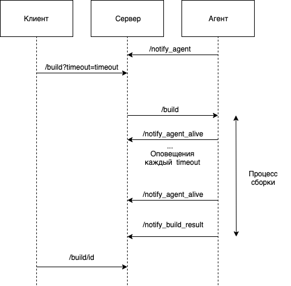
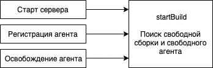

# Домашнее задание «Инфраструктура»

Приложения разделены и возможно использование их как отдельных пакетов.

## Запуск

`docker-compose up`

Сейчас настроено следующим образом:

* На `localhost:3000` запускается сервер
* Запускается один сервер и два агента

Конфигурация меняется в `docker-compose.yml` и пробрасывается внутрь.

Можно поменять:

* Адрес репозитория - `REPO`
* Число агентов
* Порты и хосты запуска

## Docker

Внутри докера запускаются сборки, для сборок внутри используется внешний докер.

`/var/run/docker.sock:/var/run/docker.sock`

## Сборка
В `registry` запушила образ с докером (`e2semenova/yandex-shri-hw-ci-runner:0.1.0`), 
чтобы агенты каждый раз не билдили его.

## Схема

## Старт сборки

## БД

Используется `sqlite` для хранения информации о сборках
(для возможности восстановления состояния).

## Требования:
* **Сервер должен генерировать уникальные номера сборок**

    В качестве идентификатора используются первичный ключ в базе данных.

* **Сервер должен максимально утилизировать имеющихся агентов**

    В момент создания сборки, добавления агента, освобождения агента вызывается 
    функция `startBuild`, что приводит к поиску свободного агента/свободной сборки
    и процессу выполнению сборки.

* **Сервер должен корректно обрабатывать ситуацию, когда агент прекратил работать между сборками**

    В случае ошибки `/build` сервер удаляет агента.

* **Сервер должен корректно обрабатывать ситуацию, когда агент прекратил работать в процессе выполнения сборки**

    В ответ на `/notify_agent` сервер посылает агенту значение интервала,
    по которому агент в процессе выполнения через `/notify_agent_alive` уведомляет
    сервер о активности.
    Если несколько интервалов подряд агент не отвечает, то сервер удаляет 
    этот агент из доступных и возвращает сборку обратно в статус `new`.

* **Сервер должен корректно обрабатывать ситуацию, когда агенты не справляются с поступающими заявками**

    Сборки сохраняются в базу, в момент освобождения агента или добавления нового
    происходит поиск новой сборки и выполнение.

* **Агент должен корректно обрабатывать ситуацию, когда не смог соединиться с сервером**

    Агент совершает попытки подключится к серверу, задержка ретраев растет экспоненциально.
    В случае, если сервер оживет, агент подключится.
